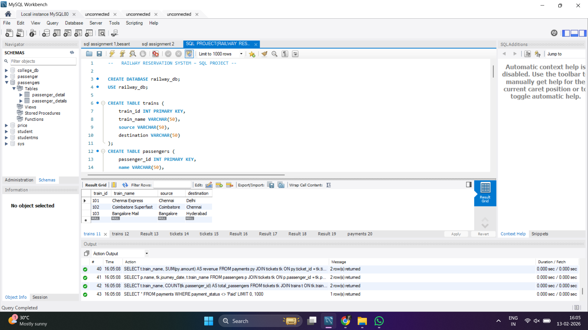

# 🚆 Railway Reservation System (MySQL)

## 📌 Project Overview
This project implements a Railway Reservation System using MySQL.
It simulates how a real-world railway booking database works by managing
trains, passengers, tickets, seat allocation, and payments.

---

## 🎯 Features
✔ Train Management  
✔ Passenger Management  
✔ Ticket Booking System  
✔ Seat Allocation  
✔ Payment Tracking  
✔ Revenue Reports  

---

## 🗄️ Database Design
Tables Used:

- trains
- passengers
- tickets
- payments

Concepts Demonstrated:

✔ Primary Keys  
✔ Foreign Keys  
✔ Table Relationships  
✔ SQL Joins  
✔ Aggregate Queries  

---

## ⚙️ Technologies Used
- MySQL
- MySQL Workbench
- SQL

---

## 📸 Screenshots

### Database Tables

---

### Ticket & Query Outputs

---

### MySQL Workbench Execution

---

## 🎯 Learning Outcomes
This project demonstrates practical understanding of:

✔ Relational Database Schema Design  
✔ Entity Relationships  
✔ SQL Query Writing  
✔ Data Retrieval & Reporting  

---

✅ Developed for SQL / DBMS Practice

